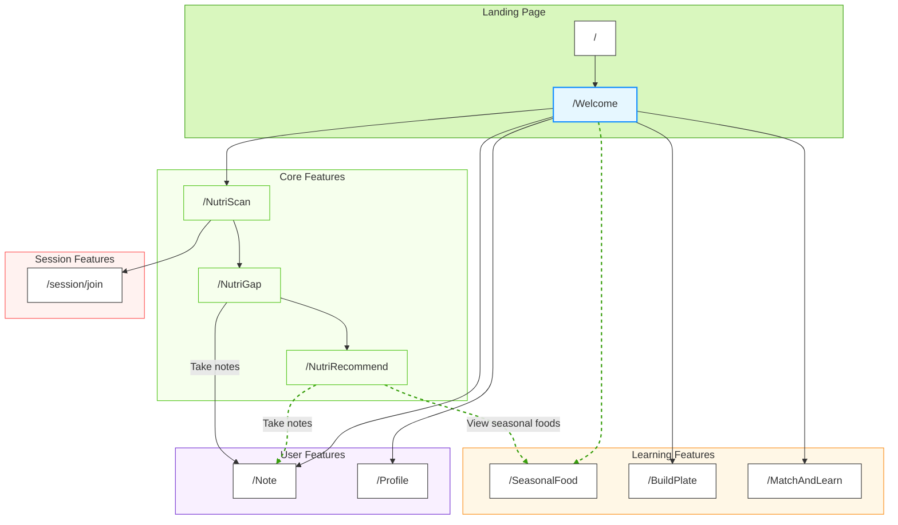

```mermaid
graph TD
    %% Main application structure
    Root["/"] --> Welcome["/Welcome"]
    
    %% Welcome Landing Page as its own group
    subgraph LandingPage [Landing Page]
        style LandingPage fill:#d9f7be,stroke:#389e0d
        Root
        Welcome
    end
    
    %% Core Features with sequential flow
    subgraph CoreFeatures [Core Features]
        style CoreFeatures fill:#f6ffed,stroke:#52c41a
        Welcome --> NutriScan["/NutriScan"]
        NutriScan --> NutriGap["/NutriGap"]
        NutriGap --> NutriRecommend["/NutriRecommend"]
    end
    
    %% Additional navigation paths
    NutriGap -->|"Take notes"| Note["/Note"]
    NutriRecommend -->|"Take notes"| Note
    NutriRecommend -->|"View seasonal foods"| SeasonalFood["/SeasonalFood"]
    
    %% Learning Features
    subgraph LearningFeatures [Learning Features]
        style LearningFeatures fill:#fff7e6,stroke:#fa8c16
        Welcome --> SeasonalFood
        Welcome --> BuildPlate["/BuildPlate"]
        Welcome --> MatchAndLearn["/MatchAndLearn"]
    end
    
    %% User Features
    subgraph UserFeatures [User Features]
        style UserFeatures fill:#f9f0ff,stroke:#722ed1
        Welcome --> Profile["/Profile"]
        Welcome --> Note
    end
    
    %% Session Features
    subgraph SessionFeatures [Session Features]
        style SessionFeatures fill:#fff2f0,stroke:#ff4d4f
        NutriScan["/NutriScan"] --> SessionJoin["/session/join"]
    end
    
    %% Styling for nodes
    classDef default fill:#fff,stroke:#333,stroke-width:1px;
    classDef active fill:#e6f7ff,stroke:#1890ff,stroke-width:2px;
    classDef feature fill:#f6ffed,stroke:#52c41a,stroke-width:1px;
    classDef pathway fill:#fff,stroke:#389e0d,stroke-width:2px,stroke-dasharray: 5 5;
    
    class Welcome active;
    class NutriScan,NutriGap,NutriRecommend feature;
    
    %% Apply pathway style to specific edges
    linkStyle 5,6,7 stroke:#389e0d,stroke-width:2px,stroke-dasharray: 5 5;
``` 